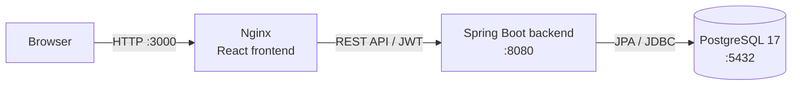
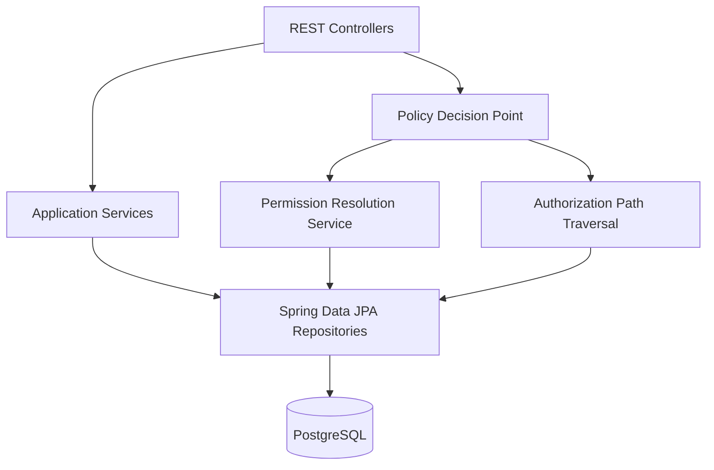

# RBAC Policy Manager

RBAC Policy Manager is an enterprise-style authorization platform that models users, roles, groups, resources, actions, and permissions. It evaluates authorization decisions through hierarchical RBAC while providing explainable permission paths that show exactly why access was granted. The project demonstrates backend system design, secure API development, authorization engine implementation, and containerized deployment using Spring Boot, PostgreSQL, React, and Docker Compose.

## Highlights

- Hierarchical RBAC authorization engine
- Explainable permission evaluation
- Spring Boot 4 + PostgreSQL architecture
- JWT-secured REST API
- React administration portal
- Docker Compose deployment
- Comprehensive unit & integration testing

## Key features

- Subject, role, group, action, resource, and permission management
- Hierarchical roles and groups, with cycle detection and depth validation
- Permission assignment through roles and groups
- Authorization evaluation for a subject, resource, and action
- Explainable `ALLOW` decisions through authorization paths
- JWT-based, stateless authentication with BCrypt password hashing
- Lifecycle states (`ACTIVE`, `DISABLED`, and `DELETED`) and scheduled retention cleanup
- React admin interface for policy management and authorization checks
- Dockerized frontend, backend, and PostgreSQL deployment
- Unit and integration tests covering authorization, lifecycle, and hierarchy behavior

## Architecture

### Deployment



The frontend is built by Vite and served as static files by Nginx. In the current Compose configuration, the browser calls the backend directly at port `8080`; Spring Security permits the frontend origin at `http://localhost:3000` through CORS.

### Backend components



Controllers handle HTTP and validation. Services manage entities and associations, while the policy decision point resolves a subject's effective permissions and produces an `ALLOW` or `DENY` decision. For permitted requests, the explainability traversal returns the role/group path that supplies the matching permission.

## Tech stack

| Area | Technology |
| --- | --- |
| Backend | Java 21, Spring Boot 4.0.6 |
| Web and validation | Spring Web MVC, Jakarta Validation |
| Security | Spring Security, JJWT, BCrypt |
| Persistence | Spring Data JPA, PostgreSQL 17 |
| Frontend | React 18, Vite 5, React Router |
| Frontend serving | Nginx |
| Build | Maven Wrapper, npm |
| Containers | Docker, Docker Compose |
| Testing | JUnit, Spring Boot Test, Spring Security Test, H2 |

## Project structure

```text
.
├── src/main/java/com/arya/rbac_policy_manager/
│   ├── api/controller/          # REST endpoints
│   ├── auth/                    # Login, JWT issuance, filter, and user details
│   ├── config/                  # Spring Security and CORS configuration
│   ├── explainability_engine/   # Authorization path models and traversal
│   ├── lifecycle_cleanup/       # Retention policy and scheduled cleanup
│   ├── platformuser/            # Administrative platform user model and seed data
│   └── rbac_engine/             # RBAC entities, associations, services, and PDP/PEP
├── src/main/resources/          # Spring configuration profiles
├── src/test/                    # Unit and integration tests
├── frontend/
│   ├── src/api/                 # API client and endpoint helpers
│   ├── src/auth/                # Auth context and protected routes
│   ├── src/components/           # Reusable interface components
│   └── src/pages/               # Dashboard and policy-management pages
├── Dockerfile                   # Multi-stage Maven backend image
├── docker-compose.yaml          # Frontend, backend, database, and volume definition
└── pom.xml                      # Backend dependencies and Maven build
```

## Getting started

### Prerequisites

- Docker Desktop or Docker Engine with Docker Compose
- Git

Java 21, Maven, Node.js, and npm are only needed when running services outside Docker.

### Clone

```bash
git clone <repository-url>
cd rbac-policy-manager
```

### Configure environment variables

Create a `.env` file in the repository root. Docker Compose reads these values when it starts PostgreSQL and the backend.

```dotenv
POSTGRES_DB=rbac
POSTGRES_USER=rbac_user
POSTGRES_PASSWORD=use-a-local-development-password
JWT_SECRET=use-a-random-secret-that-is-at-least-32-characters-long
```

Keep `.env` out of version control. For a non-containerized backend, use `src/main/resources/application-local-example.properties` as the template for an ignored `application-local.properties` file.

### Run the full stack

```bash
docker compose up --build
```

After the images build, the following services are available:

| Service | Address | Purpose |
| --- | --- | --- |
| Frontend | `http://localhost:3000` | React administration interface served by Nginx |
| Backend | `http://localhost:8080` | Spring Boot REST API |
| PostgreSQL | `localhost:5432` | Policy data, exposed for local development |

The application seeds an `admin` platform user on first startup if it does not already exist. Its initial password is `ChangeMe123!`; change it before using the application beyond local evaluation.

To stop the stack while preserving database data:

```bash
docker compose down
```

The `rbac-postgres-data` named volume retains PostgreSQL data. Removing that volume resets local data.

### Run backend tests

```bash
./mvnw test
```

## API overview

All routes except `POST /auth/login` require a bearer token in the `Authorization` header. The API is organized around these resource areas:

| Area | Responsibility |
| --- | --- |
| Authentication | Exchanges platform-user credentials for a JWT at `/auth/login` |
| Subjects | Creates and manages authorization subjects and their role assignments |
| Roles | Manages roles, role hierarchy links, and direct role permissions |
| Groups | Manages groups, group hierarchy links, role-group links, and group permissions |
| Resources, actions, permissions | Defines the protected resource/action pairs used during evaluation |
| Authorization | Checks a subject/resource/action tuple at `/api/authorization/check` and returns a decision; `ALLOW` responses include supporting paths |

Most management endpoints support create, read, update where applicable, and enable/disable operations. Refer to the controllers under `src/main/java/com/arya/rbac_policy_manager/api/controller` for request and response shapes.

## Security and authorization model

- **JWT authentication:** Login authenticates a platform user and issues a signed, expiring JWT. The backend is stateless and validates the token in a filter before protected routes execute.
- **Password handling:** Platform-user passwords are encoded with BCrypt; passwords are not compared manually in application code.
- **Authorization flow:** Effective permissions are resolved from a subject's active roles, inherited role relationships, assigned groups, and group hierarchy. The policy decision point matches the requested resource and action, returning `ALLOW` or `DENY`.
- **Explainability:** When a request is allowed, the API traverses policy relationships to return the positive evidence path, such as subject → role → group → permission. A `DENY` result intentionally returns no path because the current traversal represents positive grants only.
- **Least privilege:** API access defaults to authenticated-only. Policy objects and associations also observe lifecycle state so disabled entries are excluded from active evaluation.
- **Schema management:** The current application uses Hibernate/JPA with `spring.jpa.hibernate.ddl-auto=update`. Flyway migrations are **not yet configured** in this repository; versioned migrations are a recommended next step for controlled environment changes.

## Docker deployment

Both application images use multi-stage builds: Maven produces the executable backend JAR, while Node builds the Vite assets that are copied into a minimal Nginx image. Docker Compose builds and starts the three services together, supplies database and JWT configuration through environment variables, and creates the `rbac-postgres-data` named volume for durable PostgreSQL storage.

Services communicate over Docker Compose's default internal network using service names (the backend connects to PostgreSQL as `postgres`). Only the frontend, backend, and database ports declared in `docker-compose.yaml` are published to the host for local development.

## Design decisions

| Decision | Rationale |
| --- | --- |
| PostgreSQL | A relational model fits policy entities and their many associations, while providing durable transactional storage for local deployment. |
| Hierarchical RBAC | Role and group inheritance reduce repetitive assignments and more closely model organizational policy structures. Validation services prevent invalid hierarchy cycles. |
| Explainable authorization | An allow/deny result alone is difficult to audit during policy administration. Returning the positive grant path makes effective permissions easier to inspect. |
| JWT with stateless security | A bearer token works cleanly with a separate SPA and keeps backend request handling session-free. |
| Docker Compose | One command reproduces the frontend, API, and database topology without requiring local Java or Node tooling. |
| JPA schema update (current state) | It minimizes setup friction during local development; it should be replaced with migration-managed schema changes before production use. |

## Screenshots

> **Dashboard placeholder** — Add `docs/screenshots/dashboard.png` to show the policy-management dashboard.

> **Authorization check placeholder** — Add `docs/screenshots/authorization-check.png` to show an `ALLOW`/`DENY` result and its authorization path.

> **Role detail placeholder** — Add `docs/screenshots/role-detail.png` to show role hierarchy and permission assignment management.

## Future improvements

- Replace JPA schema auto-update with Flyway migrations and migration validation
- Add Attribute-Based Access Control (ABAC) conditions alongside RBAC grants
- Integrate LDAP or Active Directory for platform-user authentication
- Add audit events, queryable audit dashboards, and export support
- Add policy versioning, review workflows, and rollback capability
- Add tenant boundaries and tenant-aware policy evaluation
- Harden production configuration, including external secret management and configurable CORS

## License

This project is intended to be released under the MIT License. Add a `LICENSE` file before publishing.
